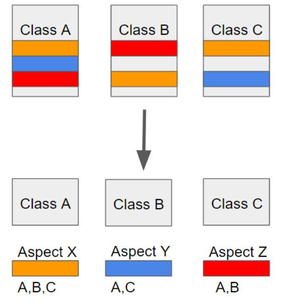
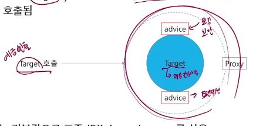

# AOP
## 요약
 
쉽게말해 자주 쓰이는 로직들 모듈화 해서 재사용성 증가시키는거임 
나중에 필요할때 다시 공부 고고

<hr>

## 1. 개념
-  쉽게 말해 어떤 로직을 기준으로 핵심적인 관점, 부가적인 관점으로 나누어서 보고 그 관점을 기준으로 각각 모듈화하겠다는 것
- 예로들어 핵심적인 관점은 결국 우리가 적용하고자 하는 핵심 비즈니스 로직이 된다. 또한 부가적인 관점은 핵심 로직을 실행하기 위해서 행해지는 데이터베이스 연결, 로깅, 파일 입출력 등을 예로 들 수 있다.
- 소스 코드상에서 다른 부분에 계속 반복해서 쓰는 코드들을 발견할 수 있는 데 이것을 흩어진 관심사 (Crosscutting Concerns)라 부른다.



- OOP에서는 모듈화의 단위가 클래스인반면 AOP에서는 모듈화 단위가 관점(Aspect)
- OOP를 더욱 발전 시키기 위한 개념

- AOP에서는 애플리케이션의 핵심 로직과는 별개로 애플리케이션의 여러 부분에서 반복적으로 사용되는 공통 기능(관심)을 분리하여 모듈화합니다. 
- 이러한 공통 기능은 '어드바이스(advice)'라고 불리는 메소드로 정의됩니다. 예를 들어, 로깅, 트랜잭션 처리, 보안 등이 이러한 공통 기능에 해당할 수 있습니다.
- 핵심 로직과 어드바이스를 결합하는 방식으로 동작.
- 이러한 결합을 weaving이라고함. 이를 통해 애플리케이션의 핵심 로직과 부가적인 기능들이 결합된 하나의 실행 가능한 코드가 생성됩니다.
- 스프링에서는 런타임에 위빙 수행
- 유지보수성, 재사용성, 가독성 더욱 향상

- 'AOP'에서 'Aspect'라는 단어는, 프로그램이나 애플리케이션을 이루는 여러 가지 관심사항 중에서 특정 관심사항을 가리키는 용어입니다. 예를 들어, 로깅이나 보안, 트랜잭션 처리와 같은 부가적인 기능이 이러한 '관심사'에 해당합니다.
- 'AOP'에서 'Aspect'라는 용어는 이러한 부가적인 기능들이 애플리케이션의 다양한 부분에 걸쳐 분포되어 있다는 것을 강조하기 위해 사용되는 용어입니다. 즉, 애플리케이션 전반에 걸쳐 분포된 '관심사'들을 하나의 모듈로 추상화하고, 이를 중앙에서 관리하고 조작할 수 있도록 만드는 것이 AOP의 목표 중 하나입니다.

## 용어 
1. Aspect : 흩어진 관심사를 모듈화 한 것. 주로 부가기능을 모듈화 한다.
2. Joint Point: Advice가 적용될 위치. 끼어들 수 있는 지점. 메서드 진입지점 또는 생성자 호출시점, 필드에서 값을 꺼내올 때 등.. 다양한 시점에 적용 가능 
3. Pointcut : JointPoint의 상세한 스펙을 정의한 것
4. Advice 
5. Target : Aspect를 적용하는 곳 
6. AOP Proxy 

## Advice Type
1. before - target메서드 호출 이전
2. after - target메서드 호출 이후
3. after returning - target 메서드 정상 동작 후
4. after throwing - target 메서드 에러 발생 후
5. around - target 메서드의 실행시기, 방법, 실행 여부를 결정


<br><br>

# Spring AOP
## 특징
1. 프록시 기반. 프록시 객체 쓰는 이유는 접근 제어 및 부가기능 추가를 위함임
2. 스프링 빈에만 AOP적용 가능

## Spring AOP Proxy
- AOP프레임워크에 의해 생성된 객체
- Spring에서는 JDK dynamic proxy 또는 CGLIB proxy이다.
- Spring AOP는 런타임에 위빙을 수행한다.
- Target객체를 호출하면, target이 호출 되는 것이 아니라 advice가 적용된 Porxy객체가 호출됨.


- 기본적으로 표준 JDK dynamic proxy사용
- 인터페이스를 구현한 클래스가 아니면 CGLIB프록시 사용

<br><br>

# 실습을 통해 프록시 개념 이해하기
## 개념
- 별거없음
- 인터페이스랑 객체들 사이에 프록시 만들고 구멍뚫어서(핵심관심사항)쓰는거임
- Person(인터페이스)  ssafy, programmer
- Person(인터페이스)- PersonProxy - ssafy, programmer

<br><br>

# Spring AOP
- 이런 프록시들을 이제 spring이 해줄거임!!
## @AspectJ 
- 일반 Java 클래스를 Aspect로 선언하는 스타일

<br><br>

# 방법1 : Spring AOP시작하기 - xml

## 1.설정하기

### 1. mavenproject -> xml에 dependencies 추가
### 2. mvn repository -> Aspectj 검색
### 3. AspectJ Weaver , AspectJ Runtime 코드 긁어서 디펜던시에 추가
### 4. 이때 <scope>runtime</scope> 는 지운다 (컴파일할때도 쓸꺼라서(?))
### 5. [참고] properties에 변수만들어서 버전관리하기
-
    ```xml
    <properties>
        <spring-version>5.3.18</spring-version>
        <aspectj-version>1.9.8</aspectj-version>
    </properties>

    ...

    <dependency>
        <groupId>org.aspectj</groupId>
        <artifactId>aspectjweaver</artifactId>
        <version>${aspectj-version}</version>
    </dependency>
    ```
### 6. 설정파일에 빈에 클래스 등록하
   - resource(source folder) > 설정파일("application.xml", spring bean configuration파일)  > 빈에 클래스 등록

### 7. aop관련 설정 로직 작성 
1. namespace에서 aop추가하기 
    - 하단 목록의 Namespaces간담에 aop 체크 -> 코드에 xmlns:aop 어쩌구 추가됨 -> aop쓸 준비가 된것임.
2. `<aop:confing>`하위에 pointcut선언
    ```xml
    <aop:config>
    <aop:pointcut expression="execution(public * ssafy.com.pjt02.service.*.doSomething())" id="mypt">
    </aop:config>
    ``` 
    - ssafy.com.pjt02.service패키지의 모든클래스의 doSomething메서드가 실행되었을때  (어드바이스가 적용된다..?)

    - [참고] pointcut선언
        - execution( 접근제한자 메서드의반환형 풀패키지명을포함한 메서드경로 )

3. Aspect위치 잡아주고 사용할 Aspect 작성 :

    ```xml
    <aop:aspect ref="myAspect">
        // before -> target메서드 실행 전
        // after -> target메서드 실행 후
        <aop:before method="before" pointcut-ref="mypt"/>
        <aop:after-returning method="afterReturning" pointcut-ref="mypt"/>
        <aop:after-throwing method="afterThrowing" pointcut-ref="mypt"/>
        <aop:after method="after" pointcut-ref="mypt"/>
    </aop:aspect>
    ```     

<br>

[참고] 이처럼, 이런 설정들을 미리 몽땅 설정파일에다가 작성을 해놔야 됨. 그래서 스프링은 설정이 반이다라는 말이 있는 것임.

<br>

## 2. 설정 다했구 이제 테스트 해보자
Testclass에서 
### 1. 컨테이너 객체 빌드
### 2. 컨테이너안의 객체 접근해서 사용
- 
    ```java
    package com.ssafy.aop;

    import org.springframework.context.ApplicationContext;
    import org.springframework.context.support.GenericXmlApplicationContext;

    public class Test {
        public static void main(String[] args) {
            // 컨테이너객체 빌드
            ApplicationContext context = new GenericXmlApplicationContext("applicationContext.xml");
            
            // bean의 객체 가져와서 p에 할당
            Person p = context.getBean("ssafy", Person.class);

            p.coding();
            
        }
    }
    ```

<br>

### 3. [주의] 인터페이스 말고 클래스로 형변환 하고싶을때 : autoproxy의 proxy-target-class 값 true로 설정해야함.

- 잠시 리마인드: getBean이 반환하는 객체는 Object타입이어서 두번째 인자에 클래스나 인터페이스를 넣음으로써 형변환을 해줬었음.
- Person p = context.getBean("ssafy", Person.class); 
-> Person은 인터페이스임. 이경우 문제 없음
- 그런데, 다음과 같이 인터페이스말고 클래스로 형변환 하고싶으면?
    ```java
    Person p = context.getBean("ssafy", Ssafy.class);
    ```
- 설정파일(xml)에 다음 코드 추가
    ```xml
    <aop:aspectj-autoproxy proxy-target-class="true"></aop:aspectj-autoproxy>
    ```
- 설명: SpringAOP는 기본적으로 표준 JDK dynamic proxy를 사용하는데, 인터페이스가 아닌 클래스 타입으로 프록시를 쓰고싶으면 CGLIB프록시를 썼었다. 그렇게 하기 위해서 설정파일에 코드를 추가한것임..

<br>

## xml 전체 코드
- 
    ```xml
    <?xml version="1.0" encoding="UTF-8"?>
    <beans xmlns="http://www.springframework.org/schema/beans"
        xmlns:xsi="http://www.w3.org/2001/XMLSchema-instance"
        xmlns:aop="http://www.springframework.org/schema/aop"
        xsi:schemaLocation="http://www.springframework.org/schema/beans http://www.springframework.org/schema/beans/spring-beans.xsd
            http://www.springframework.org/schema/aop http://www.springframework.org/schema/aop/spring-aop-4.3.xsd">

        <aop:aspectj-autoproxy proxy-target-class="true"></aop:aspectj-autoproxy>
        <bean class="com.ssafy.aop.Programmer" id="programmer"></bean>
        <bean class="com.ssafy.aop.Ssafy" id="ssafy"></bean>
        <bean class="com.ssafy.aop.MyAspect" id="myAspect"></bean>

        <aop:config>
            <aop:pointcut expression="execution(public void com.ssafy.aop.*.coding())" id="mypt"/>
            <aop:aspect ref="myAspect">
                <aop:before method="before" pointcut-ref="mypt"/>
                <aop:after-returning method="afterReturning" pointcut-ref="mypt"/>
                <aop:after-throwing method="afterThrowing" pointcut-ref="mypt"/>
                <aop:after method="after" pointcut-ref="mypt"/>
            </aop:aspect>
        </aop:config>

    </beans>
    ```


<br><br>


# case2: 메서드가 return이 있을때 + 예외처리 +(around)

1. Aspect에서 예외처리 로직 작성하고 
2. xml에서  returning과 throwing추가
```xml
			<aop:after-returning method="afterReturning" pointcut-ref="mypt" returning="num"/>
			<aop:after-throwing method="afterThrowing" pointcut-ref="mypt" throwing="th"/>
```

## around 사용해서 한번에 처리하
1. Aspect class에서 around메소드에 싹정리
```java
	public int around(ProceedingJoinPoint pjt) {
		int num = 0;
		
		this.before();
		
		try {
			num = (int) pjt.proceed();
			this.afterReturning(num);
		} catch (Throwable e) {
			this.afterThrowing(e);
		} finally {
			this.after();
		}
		return num;
	}
```
2.  xml에서 around로 한번에처리
```xml

	<aop:config>
		<aop:pointcut expression="execution(public void com.ssafy.aop.*.coding())" id="mypt"/>
		<aop:aspect ref="myAspect">
			<aop:around method="around" pointcut-ref="mypt"/>
		</aop:aspect>
	</aop:config>
```

<br><br>

# 방법2: Annotation 이용
## xml에서 할것 (두줄이 전부)
1. 소스폴더만들고 xml파일만들기
2. namespaces 에서 aop랑 context체크
3. 오토프록시 , proxy-target-class ="true" 해주고
4. context: component-scan 해주고
```xml
	<aop:aspectj-autoproxy proxy-target-class="true"></aop:aspectj-autoproxy>
	<context:component-scan base-package="com.ssafy.aop"></context:component-scan>
```

## 클래스에서 할 것
### 1. bean에 등록하고 싶은 클래스에 @Component 붙이고
### 2. Aspect클래스에는 @Component랑 @Aspect도 같이 붙인다.  (해당 클래스가 Aspect임을 지정)

### 3. 포인트컷을위한 메서드를 만들고 @Pointcut을 붙인다. execution도 넣어준다.
- 이때 메서드이름이 id가 됨
```java
	@Pointcut("execution(public * com.ssafy.aop.*.coding())")
	public void mypt() {
	}
```

### 4. 각각 적용 시점에 알맞은 어노테이션을 붙인다.
- 이 전후 처리 메서드(aspect)를  어느 핵심 기능에 적용할 것인지 정해줘야하므로 인자로 넣는다. 
- 그것을 나타내는게 바로 포인트 컷이므로 포인트컷을 인자로 넣는다.
- 인자가 하나인경우는 포인트컷만 넣어주면 되고, 인자가 두개이상인경우 value=포인트컷 형태로 넣어 줘야한다.
```java
@Component
@Aspect
public class MyAspect {
	
	@Pointcut("execution(public * com.ssafy.aop.*.coding())")
	public void mypt() {
	}
	
	@Before("mypt()")
	public void before() {
		System.out.println("컴 부팅한다");
	}
	
	@AfterReturning(value="mypt()", returning="num")
	public void afterReturning(int num) {
		System.out.println("Git Push 한다. : " + num + "개의 코드를");
	}
	
	@AfterThrowing(value="mypt()", throwing="th")
	public void afterThrowing(Throwable th) {
		System.out.println("반차를 낸다.");
		if(th instanceof OuchException) {
			((OuchException)th).handleException();
		}
	}
	
	@After("mypt()")
	public void after() {
		System.out.println("보람찬 하루를 마무리 한다.");
	}
}
```

## @Around 로 한번에 하기
- 한번에 처리하는 around 메서드 만들고
- 거기다가만 어노테이션 달면됨, 나머지에는 달 필요 없음 개꿀

```java
	@Around("mypt()")
	public int around(ProceedingJoinPoint pjt) {
		int num = 0;
		
		this.before();
		
		try {
			num = (int) pjt.proceed();
			this.afterReturning(num);
		} catch (Throwable e) {
			this.afterThrowing(e);
		} finally {
			this.after();
		}
		return num;
	}
```

<br><br>

# 참고
## Pointcut Expression 예시 (어느메서드에 적용하고 싶은지를 객체화하는것의 예시..)
```xml
execution(public**(..)) : 모든 public메서드
execution(* set*(..)) : 메서드 이름이 set으로 시작하는 모든 메서드
execution(* com.xyz.service.AccountServcie.*(..)) : AccountService 인터페이스에 정의된 모든 메서드
execution(* com.xyz.service.*.*(..)) : service package에 선언된 모든 메서드
execution(* com.xyz.service..*.*(..)) : service package또는 그 하위에 선언된 모든 메서드
within(com.xyz.service.*) : service package또는 그 하위 패키지의 모든 join point(Spring AOP에서는 메서드 실행)
```