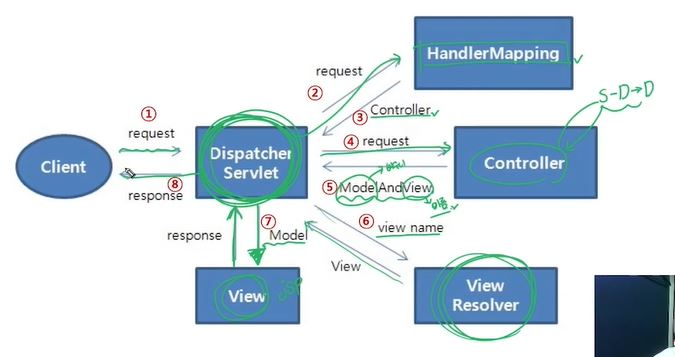

# Spring Web MVC

## 구성요소
1. DispatcherServlet - 클라이언트 요청처리
2. HandlerMapping - 요청을 어떤 Controller가 처리할 지 결정
3. Controlloer - 요청에 따라 수행할 메서드를 선언하고, 요청처리를 위한 로직 수행
4. ModelAndView - 요청처리를 하기 위해서 필요한 혹은 그 결과를 저장하기 위한 객체
5. ViewResolver - Controller에 선언된 view이름을 기반으로 결과를 반환할  view 를 결정

## 흐름
1. 요청을 DispatcherServlet이 받아서 HandlerMapping에 전달 
2. HandlerMapping이 요청에 알맞은 Controller가 뭔지 DispatcherServlet한테 다시 알려줌
3. 그럼 DispatcherServlet은 HandlerMapping이 알려준 Controller에게 전달
4. Controller에서 Service-> DAO -> DB 처리까지 다 한담에 ModelAndView를 다시 DispatcherServlet에 반환 ( 데이터랑 어떤 view로갈건지 그 view의 이름이 담긴 바구니)
5. DispatcherServlet이 이버엔 컨트롤러가 알려준 view이름을 ViewResolver에게 넘기고
6. ViewResolver가 해당 view가 정확히 어디있는지 다시 DispatcherServlet에게 알려줌
7. 컨트롤러로부터 받은 데이터를 viewResolver가 알려준 view에다가 넘겨줌
8. view(jsp파일등등)는 받은데이터로 화면을 구성한다음에 다시  response객체로서 돌려줌
9. 마지막으로 DispatcherServlet이 클라이언트에게 응답함


<br><br>

# 실습
0. configure to maven project
1. mvnrepository > Spring Web MVC 검색 후 xml에 등록
   - 그러면 Maven Dependencies 에 보면 뭐 이것저것 등록이 되어있다. 
   - Web MVC가 다 갖고 있기 때문에 자동 등록 된것이다.
## web.xml 설정하기
2. web.xml에 서블릿 등록하기  
```xml
  <servlet>
  	<servlet-name>springDispatcherServlet</servlet-name>
  	<servlet-class>org.springframework.web.servlet.DispatcherServlet</servlet-class>
  </servlet>
```
- servletname에 들어갈 경로 따오기 (방법2개)
 방법1 : 
   -> Maven Dependencies > spring-webmvc > org.springframework.web.servlet > DispatcherServlet.class 우클릭 > Copy qualified name
 방법 2  :
   - 파일에서 DispatcherServlet 쓴다음 import경로 복사해서 쓰기 (이게더편함)

### 코드
```xml
<?xml version="1.0" encoding="UTF-8"?>
<web-app xmlns:xsi="http://www.w3.org/2001/XMLSchema-instance" xmlns="http://xmlns.jcp.org/xml/ns/javaee" xsi:schemaLocation="http://xmlns.jcp.org/xml/ns/javaee http://xmlns.jcp.org/xml/ns/javaee/web-app_4_0.xsd" id="WebApp_ID" version="4.0">
  <display-name>Spring_03_MyMVC</display-name>
  <welcome-file-list>
    <welcome-file>index.html</welcome-file>
    <welcome-file>index.htm</welcome-file>
    <welcome-file>index.jsp</welcome-file>
    <welcome-file>default.html</welcome-file>
    <welcome-file>default.htm</welcome-file>
    <welcome-file>default.jsp</welcome-file>
  </welcome-file-list>
  
  <servlet>
  <!-- class값에 들어간 주소로 name의 디스패처서블릿을 등록하고 -->
  <!-- param-value의 값인 경로에있는 xml파일을 설정파일로 등록하겠다. -->
  	<servlet-name>springDispatcherServlet</servlet-name>
  	<servlet-class>org.springframework.web.servlet.DispatcherServlet</servlet-class>
  	<init-param>
  		<param-name>contextConfigLocation</param-name>
  		<param-value>/WEB-INF/servlet-context.xml</param-value>
  	</init-param> 
  </servlet>
  
  <!-- 서블릿이 어떤 url을 담당할지 매핑해줌 아래와 같이 /로 쓰면 모든 경로를 다 springDispatcherServlet에서 처리하도록 매핑한 것임. -->
  <servlet-mapping>
  	<servlet-name>springDispatcherServlet</servlet-name>
  	<url-pattern>/</url-pattern>
  </servlet-mapping>
  
  <!-- 스프링의 컨텍스트 설정파일 등록한다. -->
  <context-param>
  	<param-name>contextConfigLocation</param-name>
  	<param-value>/WEB-INF/root-context.xml</param-value>
  </context-param>
  
  <!-- 어떤 동작을 감지하고 발동하는 것에 관한 설정 -->
  <!-- library > Maven Dependencies > spring-web > ~~.web.context > ContextLoaderListener.class경로 -->
  <listener>
  	<listener-class>org.springframework.web.context.ContextLoaderListener</listener-class>
  </listener>
  
  <!-- 요청을 처리하기 전 가장 먼저 거치게 하고싶은 필터 설정 예컨대 인코딩관련 -->
  <!-- 인코딩필터의 경로 : Maven Dependencies > spring-web > ~~.web.filter > CharacterEncodingFilter.class경로 -->
  <filter>
  	<filter-name>encodingFilter</filter-name>
  	<filter-class>org.springframework.web.filter.CharacterEncodingFilter</filter-class>
  	<!-- init-param은 정해진 속성의 이름임. 
  	따라서 이 태그는 임의로 이름을 정하는게 아님.
  	마치 css스타일을 먹이듯이 속성이름과 값의 종류가 정해져있고 그 안에서 써야함. -->
  	<init-param>
  		<param-name>encoding</param-name>
  		<param-value>UTF-8</param-value>
  	</init-param>
  </filter>
  
  <!-- 어떤 url로 요청이 들어왓을때 필터를 거치도록 할것인지 매핑해줘야됨 -->
  <!-- /* 로 쓰면 모든 요청임 -->
  <filter-mapping>
  	<filter-name>encodingFilter</filter-name>
  	<url-pattern>/*</url-pattern>
  </filter-mapping>
  
</web-app>

```

## servlet-context.xml 설정하기

```xml
<?xml version="1.0" encoding="UTF-8"?>
<beans xmlns="http://www.springframework.org/schema/beans"
	xmlns:xsi="http://www.w3.org/2001/XMLSchema-instance"
	xmlns:context="http://www.springframework.org/schema/context"
	xsi:schemaLocation="http://www.springframework.org/schema/beans http://www.springframework.org/schema/beans/spring-beans.xsd
		http://www.springframework.org/schema/context http://www.springframework.org/schema/context/spring-context-4.3.xsd">

	<!-- base-package경로를 돌면서 알아서 어노테이션을 찾아서  bean객체에 등록해주도록 설정. -->
	<context:component-scan base-package="com.ssafy.mvc.controller"></context:component-scan>
	
	<!-- view resolver등록 -->
	<!-- view resolver의 기능이 뭐였냐면 이름가지고 경로 완성시켜주는 애였음 -->
	<!-- prefix랑 suffix가지고 이름 앞뒤로 붙여줄 경로를 뭐로할지 설정해주는것임. -->
	<bean class="org.springframework.web.servlet.view.InternalResourceViewResolver">
		<property name="prefix" value="/WEB-INF/view/"></property>
		<property name="suffix" value=".jsp"></property>
	</bean>
</beans>

``` 